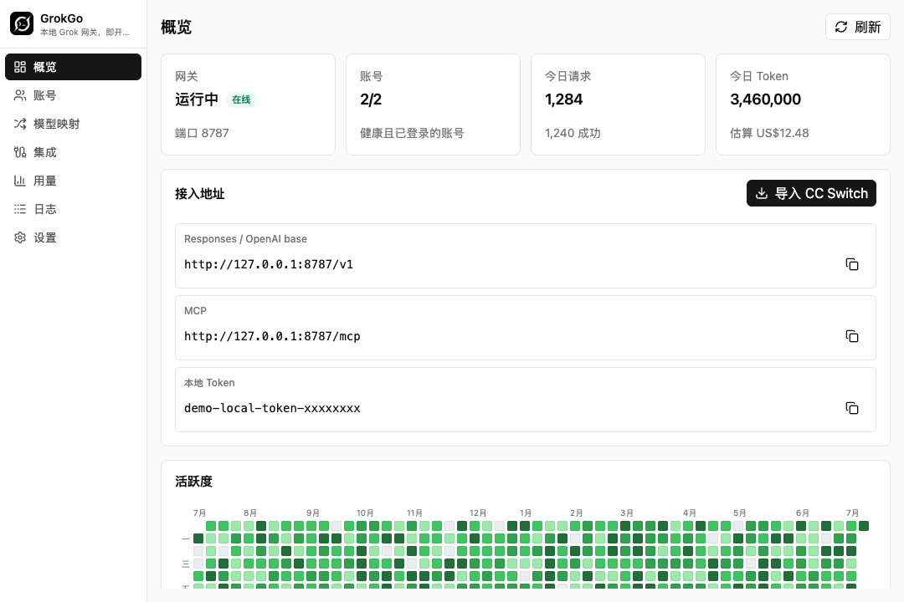
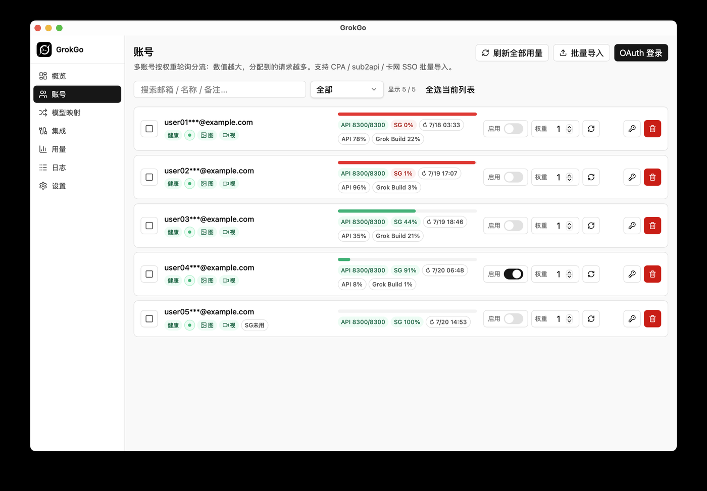
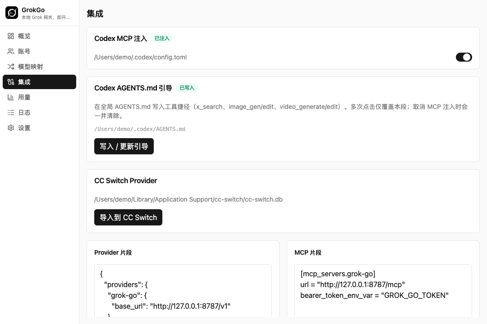
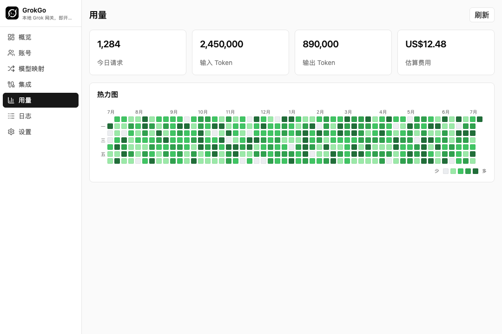

<p align="center">
  
</p>

<h1 align="center">GrokGo</h1>

<p align="center"><strong>Local Grok / xAI gateway desktop app</strong></p>
<p align="center"><em>Grok, ready to go for Codex</em></p>

<p align="center">
  <a href="./README.md">中文</a> ·
  <a href="./README_EN.md">English</a>
</p>

<p align="center">
  
  
  <a href="LICENSE"></a>
  <a href="https://github.com/RongleCat/grok-go/stargazers"></a>
  
  
</p>

<p align="center">
  Follow the author on X
  <a href="https://x.com/cgnot996"><strong>铁柱AGI@cgnot996</strong></a>
  · Repo
  <a href="https://github.com/RongleCat/grok-go">RongleCat/grok-go</a>
</p>

---

> [!CAUTION]
> ## Project discontinued
>
> **Do not use this tool anymore.**
>
> GrokGo is no longer developed or maintained. There will be no updates, compatibility fixes, or support. Continued use may break, fail to connect, or carry unknown risk.
>
> Please uninstall the app and clean up `~/.grok-go/` (and any client config you injected for Codex / others). This repository is kept only as a historical archive.

---

## Contents

1. [Overview](#overview)
2. [Features](#features)
3. [Screenshots](#screenshots)
4. [Install & first run](#install--first-run)
5. [Connect Codex / clients](#connect-codex--clients)
6. [Channel selection (important)](#channel-selection-important)
7. [API endpoints](#api-endpoints)
8. [Config paths](#config-paths)
9. [macOS “damaged” / Gatekeeper](#macos-damaged--gatekeeper)
10. [Develop & build](#develop--build)
11. [Docs & contributing](#docs--contributing)

---

## Overview

Wiring **Grok / xAI** into **Codex**, OpenAI-compatible clients, or other agents usually means handling OAuth, a local proxy, MCP, multi-account routing, and usage yourself.

**GrokGo** packages that into a local desktop gateway:

1. Install and launch  
2. Sign in or import accounts  
3. Copy Base URL + token  
4. Paste into your client  

---

## Features

| Area | What you get |
|------|----------------|
| **API compatibility** | `/v1/responses`, `/v1/chat/completions`, `/v1/models` |
| **MCP tools** | `x_search`, image generate/edit, video generate/edit |
| **Multi-account** | OAuth hosting, weighted load balancing, auto refresh |
| **Batch import** | CPA `xai-*.json` / sub2api RTs / card SSO→OAuth / GrokGo `auth.json` |
| **Media** | Images/videos through the same authenticated gateway; artifacts under `~/.grok-go/artifacts/` |
| **Usage** | Request logs (routed account), tokens, SuperGrok weekly + API limits, heatmap |
| **Integrations** | One-click Codex MCP inject, `mcp_servers.grok-go`, CC Switch provider import |
| **Access control** | Local bearer token; optional LAN access |

---

## Screenshots

> Captured from the current development build (account emails redacted).

| Overview | Accounts |
|:---:|:---:|
|  |  |

| Integrations | Usage |
|:---:|:---:|
|  |  |

---

## Install & first run

> **Discontinued: do not download or install new copies.** Links below are archival only.

### 1. Download

Get installers from [Releases](https://github.com/RongleCat/grok-go/releases):

| Platform | Artifact |
|----------|----------|
| macOS Apple Silicon | `GrokGo_*_aarch64.dmg` |
| macOS Intel | `GrokGo_*_x64.dmg` |
| Windows x64 | `.msi` / `.exe` |

### 2. First run

1. Start GrokGo and confirm the gateway is **Running** on **Overview**  
2. Sign in or batch-import accounts on **Accounts**  
3. Copy from **Overview**:  
   - Base URL: `http://127.0.0.1:<port>/v1`  
   - Local Token  
4. (Optional) Inject Codex MCP / import CC Switch on **Integrations**  

Preferred port is **8787** (auto-increments on conflict).

---

## Connect Codex / clients

### Manual setup

1. Start GrokGo and copy Base URL + Local Token from **Overview**  
2. Point your client at the **Responses API** (or OpenAI Chat Completions-compatible mode)  
3. Use:  
   - Base URL: `http://127.0.0.1:<port>/v1`  
   - Authorization: `Bearer <localToken>`  

### One-click MCP (Codex)

After enabling MCP inject on **Integrations**:

```toml
[mcp_servers.grok-go]
url = "http://127.0.0.1:<port>/mcp"

[mcp_servers.grok-go.http_headers]
Authorization = "Bearer <localToken>"
```

---

## API endpoints

| Purpose | URL |
|---------|-----|
| Base | `http://127.0.0.1:<port>/v1` |
| Responses | `POST /v1/responses` |
| Chat Completions | `POST /v1/chat/completions` |
| Images | `POST /v1/images/generations`, `POST /v1/images/edits` |
| MCP | `http://127.0.0.1:<port>/mcp` |

---

## Config paths

```text
~/.grok-go/
  config.json      # gateway / port / integrations
  auth.json        # accounts & tokens (do not commit)
  data.db          # usage & logs
  artifacts/       # media outputs
  backups/
  agents-guide.md  # runtime MCP tool guide (enabled tools only)
```

---

## macOS “damaged” / Gatekeeper

Release builds are **not Apple-notarized** (paid Developer ID required). Gatekeeper may block downloads — that is expected.

**Recommended:**

```bash
xattr -cr /Applications/GrokGo.app
open /Applications/GrokGo.app
```

**Also works:**

- Finder: **right-click** → **Open** → confirm  
- **System Settings → Privacy & Security** → **Open Anyway**  

Only download from this repo’s official [Releases](https://github.com/RongleCat/grok-go/releases). Signing + notarization will remove these steps.

---

## Develop & build

```bash
pnpm install
pnpm tauri dev      # full app
pnpm dev:ui         # frontend only
pnpm tauri build    # production
```

Cross-compile and release notes: [docs/BUILD.md](./docs/BUILD.md).

**Stack:** Tauri 2 + Rust · React + TypeScript + Vite · Tailwind CSS

---

## Docs & contributing

> This project is archived and **no longer accepts contributions or issue follow-up**.


| Audience | Link |
|----------|------|
| AI agents / codebase map | [`llm-wiki/README.md`](./llm-wiki/README.md) |
| Contributing | [CONTRIBUTING.md](./CONTRIBUTING.md) |
| Code of conduct | [CODE_OF_CONDUCT.md](./CODE_OF_CONDUCT.md) |
| Security | [SECURITY.md](./SECURITY.md) |

Issues and PRs are welcome.

## License

[MIT](./LICENSE) © RongleCat

---

<p align="center">
  If GrokGo helps you, star the repo and follow
  <a href="https://x.com/cgnot996">铁柱AGI@cgnot996</a> on X
</p>
